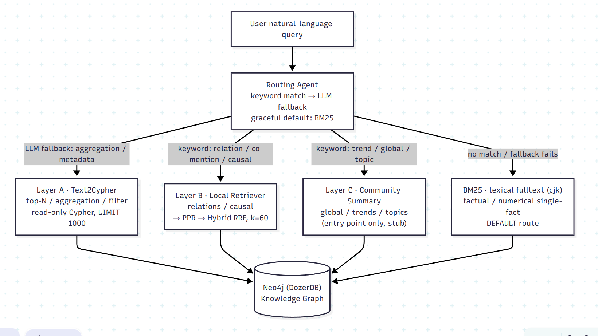

# doc-graph-agent


A Layer A/B/C **GraphRAG** system built over 8 Korean financial documents, measured against a VectorRAG baseline with 80 QA pairs to find where a knowledge graph actually helps.

---

## Overview

doc-graph-agent builds a Layer A/B/C GraphRAG system over 8 Korean financial documents (Hanwha, DS market outlook, Mirae Asset Q1–Q4, Nonghyup, FSS) and uses 80 QA pairs to diagnose where it actually helps. A VectorRAG baseline runs on the **identical ingestion** — same parsing, same chunking — so the only variable being measured is the retrieval structure itself. That keeps the VectorRAG vs GraphRAG comparison honest.

## TL;DR

> GraphRAG isn't a system that answers every query. It's a system that answers a specific class of queries that RAG structurally cannot reach. And every decision here was made by measurement, not by feel.

---

## Final Results

80 QA (VectorRAG 40 + GraphRAG 40), final hybrid configuration. Answer LLM is GPT-5.2, judge is claude-haiku-4.5.

| Metric | VectorRAG (40) | GraphRAG (40) | Notes |
|---|---|---|---|
| Answer Correctness (/5) | **3.73** | 2.90 | VectorRAG ahead — GraphRAG is capped by extraction quality |
| Faithfulness | 89.5% | **100%** (39/39) | GraphRAG ahead — graph-grounded answers don't hallucinate |
| Numerical Accuracy | **0.664** | 0.536 | Reflects metric-extraction and parsing limits |
| Conciseness (/5) | **4.34** | 4.10 | Roughly even |
| Avg. latency | **6.4s** | 9.3s | Graph traversal + extra LLM step add cost |

Routing distribution — VectorRAG: bm25 37 / community 2 / t2c 1. GraphRAG: hybrid 24 / bm25 9 / t2c 6 / community 1.

For plain fact and number lookups, lexical search (BM25) is the more natural fit. For absence proofs and meta-queries, where the graph structure *is* the answer, GraphRAG wins outright. GraphRAG is a trade-off, not a verdict — and the production answer is a hybrid of both.

---

## Where GraphRAG wins, and where it struggles

### Wins — the graph structure is the answer

- **negative (absence proof)** — proving "document X does not contain Y." The graph structure produces the answer directly; RAG has no structural way in.
- **limitation (meta-query)** — what the system does and doesn't know.
- **filter_agg (corpus aggregation)** — aggregations that cut across the whole corpus.

### Struggles — extraction quality sets the ceiling

- **Entity label misclassification** — before fixes, only 1 of 186 `Company` nodes was a real company name; the rest were metrics or category labels misclassified by the extractor. Preprocessing LLM quality decides the whole system.
- **Missing Metric nodes** — numeric entities that never got extracted.
- **Parsing done without a VLM** — ingestion relied on text/OCR parsers rather than a vision-language model, so scanned and figure-heavy content was partly lost before it ever reached the graph.
- **Layer C not fully implemented** — Community Summary exists only as an entry point and routing branch.

---

## Improvement journey — measure → diagnose → fix → re-measure

The first measurement was a clean loss to the BM25 baseline (AC 1.2–1.5 vs ~4.0). From there the loop was: change one variable, re-measure on the full 80 QA, repeat. Negative results were kept rather than deleted, because each failed attempt pointed at the real bottleneck.

| Step | Attempt | Result (before → after) | Verdict |
|---|---|---|---|
| 1. Extraction recovery | GPT-5.2 + prompt v2 + tokens 1.5k→4k + surfaced failures | Doosan Bobcat 0→99 entities, total 178→1,100, AC 2.05→2.60 | Success |
| 2. Answer prompt | Drop jargon + analyst persona + 2–4 sentences | Faithfulness 20→12.5%, AC down | Negative |
| 3. Chunk rerank | bge-m3 cosine top-3 over MENTIONS chunks | Flat/down across metrics, latency 10.4→25s | Negative |
| 4. BM25 hybrid | cjk lexical search over `Chunk.text`, bypassing the graph | VectorRAG AC 2.60→3.58, latency 10.4→6.4s | Success |
| 5. PPR (HippoRAG) | Personalized PageRank from seeds, reaching past 1-hop | local AC 2.04→2.25 (24 items) | Partial |
| 6. Hybrid (RRF) | Fuse bm25 + ppr chunks (k=60), answer once | graph40 AC 2.58→2.90, Faithfulness 100% | Success (best) |

The negatives in steps 2 and 3 are what mattered: they showed the bottleneck was neither ranking nor prompting but the candidate pool (chunks bound by MENTIONS) plus lossy parsing. That diagnosis set the direction for step 4 onward — route around the graph for lexical queries.

The arc ended at Faithfulness 100% + AC 2.90. Fusing lexical (BM25) and structural (PPR) retrieval didn't lift AC further, because the remaining gap is in the data, not the retriever: metric values aren't bound to their reporting period (so time-series reconstruction fails), and since parsing was done without a VLM, some content never entered the graph. Both are extraction/parsing problems, so the retrieval work wrapped up here.

---

## Metric illusions — a single number lies

The biggest lesson from the loop: reading one metric in isolation leads to the wrong decision. It happened three times.

1. **Faithfulness looked low (step 2).** It read like heavy hallucination. In fact the metric compared the answer character-by-character against the gold string rather than the retrieved context, so a helpful, complete answer got penalized. The metric definition was fixed.
2. **Routing Accuracy dropped 85% → 67.5% (step 4).** It looked like the router got worse. In fact bm25 was tagged "wrong route" yet still produced correct answers, so it was penalized for being right (the 9 "wrong-label" items scored AC 3.22 vs 2.08 for the 24 local items).
3. **Faithfulness looked high at 97% (step 5).** It read like excellent retrieval. In fact dodging the question ("can't confirm") avoids any false statement, so faithfulness inflated for free. The genuinely dangerous hallucinations were just 1 of 40.

---

## Architecture



| Layer | Responsibility | Query type | Retrieval strategy |
|---|---|---|---|
| **A: Document Structure** | Source tracing, verbatim citation | "What is Y in document X?" | Text-to-Cypher (read-only, LIMIT 1000) |
| **B: Entity Interaction** | Semantic links, relation traversal | "How are A and B related?" | Local Retriever → PPR → Hybrid (RRF) |
| **C: Community/Topic** | Global summary | "What's the overall trend?" | Community Summary |

Layer B hit a candidate-pool bottleneck in subgraph expansion from entity seeds, so it was reinforced with PPR (reaching past 1-hop) and a BM25⊕PPR hybrid (RRF, k=60). Layer C is implemented up to its entry point and routing branch; Leiden community detection and map-reduce synthesis are next.

---

## Evaluation setup

| Item | Value |
|---|---|
| Eval set | 80 QA (VectorRAG 40 + GraphRAG 40), `qa_pairs.json` frozen |
| Document corpus | 8 docs (Hanwha, DS outlook, Mirae Asset Q1–Q4, Nonghyup, FSS) |
| Extraction / answer LLM | `openai/gpt-5.2` (via OpenRouter) |
| Judge | `anthropic/claude-haiku-4.5` |
| Embedding | BGE-M3 (NED / dedup / rerank, run locally) |
| Metrics | ROUGE-L (mecab-ko), Numerical Accuracy, Faithfulness, Answer Correctness, Semantic Similarity, Entity Coverage, Routing Accuracy |

Metrics are split into Tier 1 (traditional + FineSurE) and Tier 2 (RAGAS + GraphRAG-Bench). Routing Accuracy is GraphRAG-only, since VectorRAG has no routing structure.

---

## Quick start

### 1. Environment

```bash
uv sync
cp .env.example .env  # OpenRouter key + Neo4j connection
```

### 2. Start Neo4j (DozerDB)

```bash
docker compose up -d neo4j
```

### 3. Index the 8 documents

```bash
uv run python scripts/run_ingestion.py
uv run python scripts/load_graph.py
```

### 4. Run the 80 QA evaluation

```bash
uv run python scripts/run_qa_eval.py \
  --llm-model "openai/gpt-5.2" \
  --judge-model "anthropic/claude-haiku-4.5" \
  --qa-set both \
  --tag my_run
```

### 5. Generate result tables

```bash
uv run python scripts/make_report_tables.py \
  --in  eval/results/qa_eval_*.json \
  --out eval/results/report_tables.md
```

---

## Directory structure

```
doc-graph-agent/
├── docs/
│   ├── adr/                    # Architecture Decision Records (0001–0004)
│   ├── ontology/               # Layer A/B/C domain ontology
│   ├── before-after.md         # VectorRAG → GraphRAG mapping
│   └── weekly-log/             # weekly progress
├── ingestion/                  # ingestion + Layer A adapter
│   ├── adapter.py              #   parse result → Layer A objects
│   ├── models.py               #   Layer A node dataclasses
│   ├── chunker.py              #   chunk 700 / overlap 200
│   └── doc_parser/             #   PDF/DOCX/HWP parsers + OCR
├── kg/                         # knowledge graph construction
│   ├── ontology.py             #   5 EntityType + 4 RelationType (Pydantic)
│   ├── extractor.py            #   LLM entity/relation extraction (prompt v1→v2)
│   ├── linking.py              #   NED + dedup (cosine 0.92)
│   ├── builder.py              #   idempotent Cypher MERGE load
│   ├── neo4j_client.py         #   Neo4j (DozerDB) driver
│   └── prompts/                #   entity_system / entity_extract (v1·v2)
├── retrieval/                  # Layer A/B/C retrieval + routing
│   ├── text2cypher.py          #   Layer A (read-only)
│   ├── local_retriever.py      #   Layer B
│   ├── ppr_retriever.py        #   Personalized PageRank (HippoRAG)
│   ├── bm25_retriever.py       #   BM25 lexical search (cjk)
│   ├── hybrid_retriever.py     #   bm25 + ppr RRF fusion (k=60)
│   ├── community_summary.py    #   Layer C (entry point only, stub)
│   └── router.py               #   routing agent
├── agent/llm_client.py         # LLM call adapter (tenacity retry)
├── observability/tracing.py    # Opik @track, layer=A|B|C span meta
├── eval/
│   ├── dataset/qa_pairs.json   # eval set (80 QA, frozen)
│   ├── metrics/                # Correctness / Faithfulness / numeric / ROUGE
│   └── results/                # result JSON + tables
├── scripts/
│   ├── run_qa_eval.py          # 80 QA evaluation
│   ├── make_report_tables.py   # result JSON → tables
│   └── explore_graph.py        # Neo4j graph exploration / stats
├── tests/
├── AGENTS.md                   # Codex / Cursor context
└── CLAUDE.md                   # Claude Code context
```

---

## Branch / commit conventions

| Branch | Purpose |
|---|---|
| `main` | presentation / submission |
| `dev` | integration |
| `feat/{issue}-{kebab-case}` | feature (e.g. `feat/12-text2cypher`) |
| `fix/...` · `docs/...` · `refactor/...` · `chore/...` | prefix by purpose |

Conventional Commits — `tag(scope): #issue description`

```
feat(kg): #5 add cosine-similarity dedup to entity linking
fix(retrieval): #12 cap Text2Cypher results at 1000 rows
docs(adr): #3 record Layer separation decision
```
