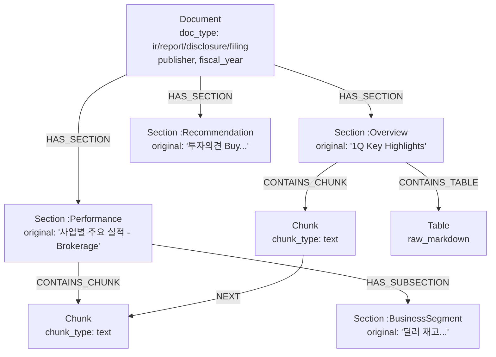

# Document Structure Ontology (Layer A)

> Status: **DRAFT v1** · 2026-05-02 · 작성자: @TaskerJang
> 결정 근거: [#9 멘토링 결정](https://github.com/TaskerJang/doc-graph-agent/issues/9#issuecomment-4363821681) · [#9 평가 셋 분석](https://github.com/TaskerJang/doc-graph-agent/issues/9#issuecomment-4363833813)

## 0. 목적

본 문서는 doc-graph-agent의 **Layer A (Document Structure)** 온톨로지를 정의한다. Layer A는 출처 추적과 원문 인용을 담당하는 계층으로, "X 보고서의 Y 섹션 Z 페이지에 있다"는 질의가 명시적으로 풀려야 한다.

본 설계는 두 가지를 동시에 달성하는 것을 목표로 한다.
1. 기존 회사 레포 `doc-summary-agent/chunker/chunker.py`의 정규식 기반 추출 한계를 그래프 모델로 구조적 해소
2. 한국 금융 도메인 5종 문서(증권사 리포트, IR 자료, 사업보고서, 보도자료)에 일관 적용 가능한 Section 스키마 제공

## 1. 기존 한계 분석 — 무엇을 풀어야 하는가

새 온톨로지의 설계 기준은 기존 `chunker.py`가 풀지 못한 4가지 한계에서 출발한다.

### 1.1 평면 `section: str` — Section 간 관계 표현 불가 (#111)

```python
class Chunk(TypedDict):
    section: str  # 단순 문자열
    ...
```

**문제**: Section이 문자열로만 박혀 있어 Section 간 부모-자식 관계, Chunk 순서 보장, Section 자체의 메타데이터(목차 번호, 페이지 범위) 표현 불가. 회사 레포 이슈 #111의 `_make_sources` 정합성 문제가 여기서 발생.

**Layer A 해결**: Section을 명시적 노드로 승격. `Document → Section → Chunk` 3계층 그래프로 표현. Section의 `HAS_SUBSECTION` 자기 참조 관계로 계층 표현. `Chunk -[:NEXT]-> Chunk`로 순서 보존.

### 1.2 `_SECTION_TYPE_MAP` — 정규식 분류의 다의성·범위 한계

```python
_SECTION_TYPE_MAP: list[tuple[frozenset[str], str]] = [
    (frozenset(["실적", "매출", ...]), "실적"),
    (frozenset(["리스크", "위험", ...]), "리스크"),
    (frozenset(["전망", "outlook", ...]), "전망"),
]
```

**문제**:
- 3개 카테고리뿐 — 평가 셋 41개 QA의 다양한 섹션 유형(투자의견, 사업부문별 실적, 통계 개황 등)을 못 잡음
- `text[:100]`만 보고 분류 결정 → 도입부 키워드에 좌우됨
- 다의성 처리 불가: "리스크 관리 전략"은 `리스크`로만 분류, `전망` 가능성 무시
- 면책·법적 고지 등 노이즈 섹션은 별도 `SKIP_SECTION_KEYWORDS`로 처리 — 온톨로지 외부의 휴리스틱

**Layer A 해결**: Section 노드의 라벨을 보편 8개 타입으로 정의(§3.2). LLM 기반 분류로 다의성·문맥 반영. `Disclaimer` 라벨을 명시적으로 추가하여 휴리스틱을 온톨로지 안으로 흡수.

### 1.3 `_extract_doc_year` — 최빈 연도 휴리스틱

```python
counter = Counter(years)
candidates = [y for y, c in counter.items() if c == most_common_count]
return max(candidates)
```

**문제**: "2023년 실적 분석" 본문에 "2024년 전망" 단락만 길어도 2024로 잡힘. 보고서의 회계연도와 본문 청크의 참조 연도를 구분 못함.

**Layer A 해결**: `Document.fiscal_year` 속성을 표지·표제부에서 명시 추출. Chunk 단위의 `referred_year`는 별도 속성으로 분리(Layer B에서 다룸).

### 1.4 `_extract_metrics` — 토큰 매칭의 의미 손실

토큰 매칭만 하므로 "영업이익 1조 2천억"에서 "영업이익"만 추출되고 값·기간·범위(연결/별도) 정보는 모두 버려짐.

**Layer A 해결**: 본 한계는 Layer B(Entity)에서 본격 해결. Layer A는 Chunk가 어떤 Section에 속하는지까지만 책임지고, Metric 구조화는 Layer B로 위임.

## 2. Section 스키마 설계 결정 — 왜 옵션 C인가

평가 셋 41개 QA 분석 결과, 5종 문서가 섞여 있어 단일 분류 체계로는 일관 적용이 어려움.

| 옵션 | 설명 | 장점 | 단점 |
|---|---|---|---|
| A | 문서 타입별 5개 스키마 분기 | 정확한 매핑 | W3 Entity 추출 프롬프트 5배 복잡 |
| B | 보편 라벨만 (Overview/Performance 등) | 단일 스키마 | 원본 섹션명 정보 손실 |
| **C** | **보편 라벨 + doc_type / original_section 속성** | **그래프 단순 + 정보 보존 + 라우터 분기** | **약간의 코드 복잡도** |

**옵션 C 채택**. 핵심은 라벨은 보편적이되 속성에 원본 정보를 보존하는 2-tier 구조.

```
Section {
  label: <8개 보편 타입 중 하나>,
  doc_type: "report" | "ir" | "disclosure" | "filing",
  original_section: <원본 섹션명 그대로>,
  ...
}
```

이러면 LLM은 보편 라벨로만 분류하면 되고(W3 프롬프트 단순), 라우터는 `doc_type`으로 문서 타입 분기 가능, 발표 자료는 `original_section`으로 원본 추적 가능.

## 3. Layer A 노드 정의

### 3.1 Document

문서 단위. 업로드된 PDF/DOCX/HWP 1개당 1노드.

```cypher
(:Document {
  id: string,                    // UUID 또는 파일 hash
  filename: string,              // 원본 파일명
  doc_type: enum,                // "report" | "ir" | "disclosure" | "filing"
  source_format: enum,           // "pdf" | "docx" | "hwp"
  publisher: string,             // 발행 기관 (한화투자증권, 미래에셋증권, 금감원 등)
  subject: string?,              // 주제 (분석 대상 회사명, IR이면 자사명)
  fiscal_year: int?,             // 회계연도 (표지 명시 추출, _extract_doc_year 대체)
  published_at: date?,           // 발행일
  total_pages: int,
  ingested_at: datetime
})
```

**doc_type 분류 기준**:
- `report` — 증권사·연구기관의 리포트 (한화-두산밥캣 분석, DS 시황)
- `ir` — 기업 자체 IR 자료 (미래에셋 분기 실적)
- `disclosure` — 정부·감독기관 공시·보도자료 (금감원 자료)
- `filing` — 법정 공시 사업보고서 (농협 사업보고서)

### 3.2 Section

문서 내 섹션. 보편 8개 라벨 + 속성으로 원본 보존.

**보편 라벨 (8개)**:

| 라벨 | 설명 | 평가 셋 예시 |
|---|---|---|
| `Overview` | 표지, 요약, Key Highlights | "1Q 2025 Key Highlights", "표지", "개황" |
| `Performance` | 실적·재무 수치 | "사업별 주요 실적 - Brokerage", "주요사업 추진 현황" |
| `Outlook` | 전망·가이던스·목표 | "상저하고의 2026년을 기대" |
| `Risk` | 리스크 요인·불확실성 | (평가 셋 미사용, W3에서 추가 검증) |
| `Recommendation` | 투자의견·목표주가 | "투자의견 Buy, 목표주가 80,000원 유지" |
| `BusinessSegment` | 사업부문별 분석 | "사업별 주요 실적 - Trading", "딜러 재고, 비워냈으니 채울 차례" |
| `Statistics` | 통계·집계 데이터 | "주식·회사채 발행 실적", "지수 종합" |
| `Disclaimer` | 면책·법적 고지 | (`SKIP_SECTION_KEYWORDS` 대상의 명시화) |

**속성**:
```cypher
(:Section {
  id: string,
  label: enum,                   // 위 8개 중 하나 (다중 라벨 허용 검토 — W3에서 결정)
  doc_type: enum,                // 부모 Document의 doc_type 복사 (조회 효율)
  original_section: string,      // 원본 섹션명 그대로 (예: "1Q 2025 Key Highlights")
  heading_level: int,            // 1=h1, 2=h2, 3=h3
  page_start: int?,
  page_end: int?,
  order_index: int               // 문서 내 순서
})
```

**다중 라벨 검토**: "리스크 관리 전략" 같은 섹션은 `Risk`+`Outlook` 둘 다 가능. W3 Entity 추출 시점에 single-label vs multi-label 결정. 기본값은 single-label로 시작하되 우선순위 라벨 정의 필요.

### 3.3 Chunk

LLM 입력 단위. 기존 `chunker.py`의 700자 청크 정책 유지.

```cypher
(:Chunk {
  id: string,
  text: string,
  chunk_type: enum,              // "text" | "table"
  char_count: int,
  page: int?,
  order_index: int               // Section 내 순서
})
```

**chunk_size**: 700자 (기존 정책 유지). 700으로 결정한 근거는 회사 레포 chunker.py 주석 참조.

### 3.4 Table

표 청크. `_is_table_block`으로 분리되던 표 데이터를 명시 노드로 승격.

```cypher
(:Table {
  id: string,
  raw_markdown: string,          // 원본 마크다운 표
  caption: string?,              // 표 제목 (있을 때)
  row_count: int,
  column_count: int,
  page: int?
})
```

**근거**: 평가 셋의 미래에셋 IR 자료, 금감원 보도자료에서 표 기반 QA가 다수 (numerical 16/41). 표를 텍스트와 동일하게 처리하면 추출 정확도 떨어짐. Layer B에서 표의 셀 단위로 Metric 추출이 자연스럽도록 별도 노드.

## 4. Layer A 관계 정의

```
(:Document)-[:HAS_SECTION]->(:Section)
(:Section)-[:HAS_SUBSECTION]->(:Section)         // 자기 참조 (계층)
(:Section)-[:CONTAINS_CHUNK]->(:Chunk)
(:Section)-[:CONTAINS_TABLE]->(:Table)
(:Chunk)-[:NEXT]->(:Chunk)                        // Section 내 순서 (#111 해결)
(:Chunk)-[:NEXT_SECTION]->(:Chunk)                // 섹션 경계 넘는 순서 (선택)
```

**관계별 카디널리티**:
- `Document → Section`: 1:N
- `Section → Section`: 0:N (계층, 최대 3depth로 제한)
- `Section → Chunk`: 1:N
- `Section → Table`: 0:N
- `Chunk → Chunk (NEXT)`: 0:1 (Section 내 마지막 청크는 NEXT 없음)

## 5. 5개 QA 매핑 검증 — DoD

평가 셋 5종 문서에서 각 1개씩 선정하여 매핑 가능성 검증.

### 5.1 hanwha_001 — 증권사 기업분석 리포트

> Q: "두산밥캣의 목표주가는 얼마인가?" / A: "80,000원"
> 원본 섹션: "투자의견 Buy, 목표주가 80,000원 유지"

```cypher
MATCH (d:Document {filename: "한화투자증권_두산밥캣_기업분석_리포트.pdf", doc_type: "report"})
      -[:HAS_SECTION]->
      (s:Section:Recommendation {original_section: "투자의견 Buy, 목표주가 80,000원 유지"})
      -[:CONTAINS_CHUNK]->
      (c:Chunk)
RETURN c.text
```

**필요 노드**: `Document`, `Section(:Recommendation)`, `Chunk`. ✅ 매핑 가능.

### 5.2 ds_001 — 증권사 시황 리포트

> Q: "이 리포트의 발행일과 담당 연구원은?" / A: "2026년 3월 16일, 김현지 연구원(02-709-2663)"
> 원본 섹션: "지수 종합"

발행일·연구원은 본래 표지 메타데이터. `Document.published_at`과 발행 기관 정보로 조회 가능. 다만 평가 셋이 `section: "지수 종합"`으로 라벨링했으므로 본문 청크에서도 답이 있음.

```cypher
MATCH (d:Document {filename: "DS투자증권_시황분석_리포트.pdf"})
RETURN d.published_at, d.publisher
// 또는
MATCH (d)-[:HAS_SECTION]->(s:Section:Statistics {original_section: "지수 종합"})
      -[:CONTAINS_CHUNK]->(c:Chunk)
RETURN c.text
```

**필요 노드**: `Document` (메타데이터로 충분) 또는 `Section(:Statistics)`. ✅ 매핑 가능.

**발견**: 발행일·연구원·발행기관 같은 표지 메타데이터가 자주 질의됨. `Document` 노드 속성에 `analyst_name`, `analyst_contact` 추가 검토 필요(W3에서).

### 5.3 mirae_4q_001 — IR 실적 보고서

> Q: "미래에셋증권 2025년 연간 연결 세전이익과 순이익은?" / A: "세전이익 2조 794억원, 순이익 1조 5,829억원"
> 원본 섹션: "2025 Key Highlights"

```cypher
MATCH (d:Document {filename: "미래에셋증권_4분기_실적보고서.pdf", doc_type: "ir"})
      -[:HAS_SECTION]->
      (s:Section:Overview {original_section: "2025 Key Highlights"})
      -[:CONTAINS_CHUNK|CONTAINS_TABLE]->
      (n)
RETURN n
```

**필요 노드**: `Document`, `Section(:Overview)`, `Chunk` 또는 `Table`. ✅ 매핑 가능.

**발견**: "세전이익", "순이익" 등 구체적 Metric 추출은 Layer B 책임. Layer A는 "어느 섹션에 답이 있는가"까지만 책임지고, Metric 값 추출은 Layer B의 `(:Company)-[:HAS_METRIC]->(:Metric)`로 풀림.

### 5.4 nonghyup_001 — 사업보고서 (HWP)

> Q: "이 사업보고서의 보고 기관명과 조합장은?" / A: "청산농업협동조합, 조합장 차동악"
> 원본 섹션: "표지"

```cypher
MATCH (d:Document {filename: "농협_2022년_9월말_기준_사업보고서.hwp", doc_type: "filing"})
      -[:HAS_SECTION]->
      (s:Section:Overview {original_section: "표지"})
      -[:CONTAINS_CHUNK]->
      (c:Chunk)
RETURN d.publisher, c.text
```

**필요 노드**: `Document`, `Section(:Overview)`, `Chunk`. ✅ 매핑 가능.

**발견**: HWP 포맷의 "표지"가 PDF의 "Key Highlights"와 같은 `Overview` 라벨로 통합됨. 옵션 C의 보편 라벨이 포맷 차이를 흡수하는 효과 확인.

### 5.5 fss_001 — 금감원 보도자료

> Q: "2025년 10월 중 주식·회사채 공모발행액 합계는?" / A: "23조 7,050억원..."
> 원본 섹션: "개황"

```cypher
MATCH (d:Document {filename: "금융감독원_..._직접금융_조달실적.docx", doc_type: "disclosure"})
      -[:HAS_SECTION]->
      (s:Section:Overview {original_section: "개황"})
      -[:CONTAINS_CHUNK|CONTAINS_TABLE]->
      (n)
RETURN n
```

**필요 노드**: `Document`, `Section(:Overview)`, `Chunk` 또는 `Table`. ✅ 매핑 가능.

### 5.6 매핑 검증 종합

5종 문서 모두 Layer A 그래프로 매핑 가능. 다만 다음 발견:
1. `Document` 속성에 발행 기관·발행일 외에 **`analyst_name`, `analyst_contact`** 같은 표지 메타데이터 필드 추가 검토(W3)
2. **"표지" / "Key Highlights" / "개황"** 같은 도입부 섹션이 모두 `Overview`로 통합됨 — 보편 라벨의 일반화 효과 확인
3. **`Section` 라벨 다중성**은 평가 셋 5개 검증에서는 불필요 — 일단 single-label로 시작
4. Metric 값 추출(numerical 16/41)은 모두 Layer B 책임으로 위임 — Layer A 책임 범위 명확화

## 6. 구조 다이어그램



## 7. 다음 단계

- [ ] W3 Entity 추출(#13) 시 본 문서의 Section 라벨 8개를 LLM 분류 enum으로 입력
- [ ] `entity-ontology.md` (Layer B) 작성 — Company, Metric, Risk, Outlook + DART XBRL 활용
- [ ] `community-ontology.md` (Layer C) 작성 — Community, Topic + 알고리즘 선택 (W4)
- [ ] ADR 0002 작성 — DART 차용 결정 + 옵션 C 채택 박제
- [ ] W3에서 Section 다중 라벨 필요성 재검토

## 8. 미결정 사항

| 항목 | 결정 시점 | 근거 |
|---|---|---|
| Section 다중 라벨 허용 여부 | W3 #13 | 실제 LLM 추출 결과 보고 결정 |
| `Chunk -[:NEXT_SECTION]-> Chunk` 도입 여부 | W3 후반 | 섹션 경계 넘는 질의 빈도 보고 결정 |
| `Document.analyst_name` 등 표지 메타 추가 | W3 #13 | 증권사 리포트 패턴 분석 후 |
| Section 계층 깊이 제한 | W3 | 실제 문서 구조 보고 결정 (현재는 3depth) |

## 9. 참고

- 결정 근거: [#9 멘토링 결정](https://github.com/TaskerJang/doc-graph-agent/issues/9#issuecomment-4363821681), [#9 평가 셋 분석](https://github.com/TaskerJang/doc-graph-agent/issues/9#issuecomment-4363833813)
- 기존 회사 레포: [doc-summary-agent/chunker/chunker.py](https://github.com/TaskerJang/doc-summary-agent/blob/dev/chunker/chunker.py) — 한계 분석의 출발점
- 평가 셋: [doc-summary-agent/eval/dataset/qa_pairs.json](https://github.com/TaskerJang/doc-summary-agent/blob/dev/eval/dataset/qa_pairs.json) — 41 QA, 5종 문서
- FIBO Foundation: https://spec.edmcouncil.org/fibo (Layer B 보편 클래스 차용 시 참조)
- DART XBRL Taxonomy: http://xbrl.or.kr/ (Layer B Metric 표준화 시 참조)
- 글 [GraphRAG #3] 온톨로지로 첫 KG 만들기 (5/2 발행, velog) — 본 설계의 이론적 배경
